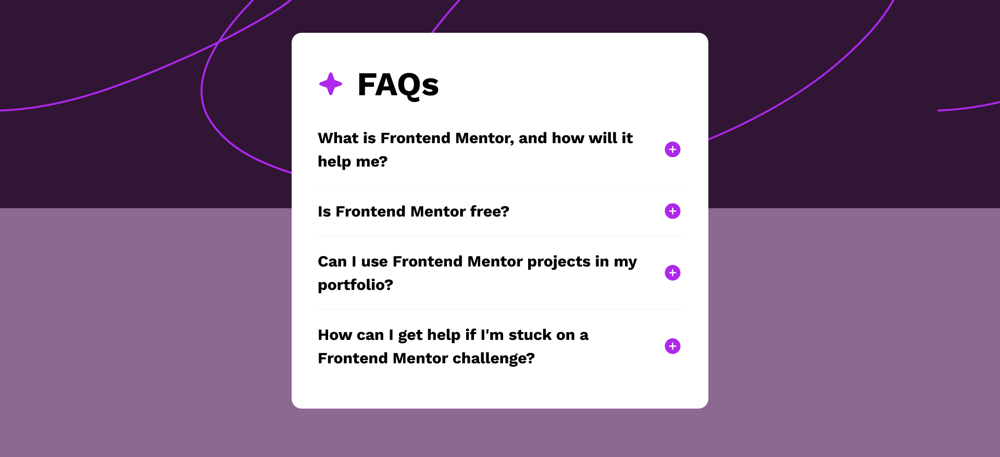
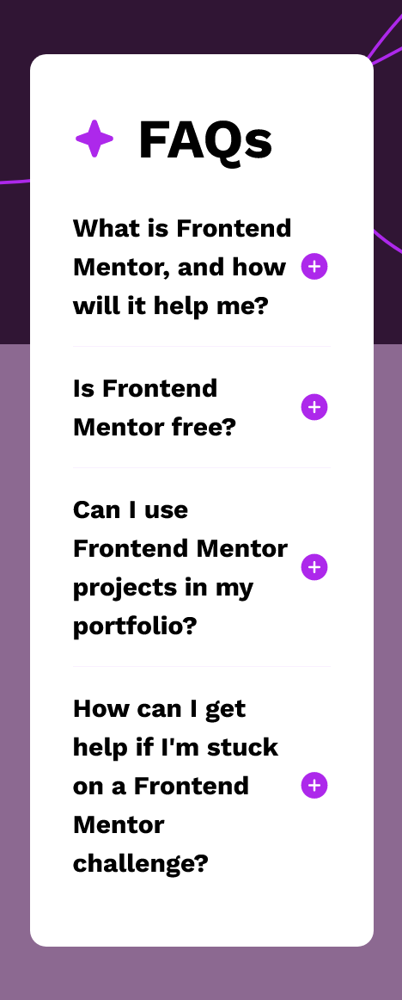

# Frontend Mentor - FAQ accordion solution

This is a solution to the [FAQ accordion challenge on Frontend Mentor](https://www.frontendmentor.io/challenges/faq-accordion-wyfFdeBwBz). Frontend Mentor challenges help you improve your coding skills by building realistic projects. 

## Table of contents

- [Overview](#overview)
  - [The challenge](#the-challenge)
  - [Screenshot](#screenshot)
  - [Links](#links)
- [My process](#my-process)
  - [Built with](#built-with)
  - [What I learned](#what-i-learned)
  - [Continued development](#continued-development)
  - [Useful resources](#useful-resources)
- [Author](#author)

## Overview

### The challenge

Users should be able to:

- Hide/Show the answer to a question when the question is clicked
- Navigate the questions and hide/show answers using keyboard navigation alone
- View the optimal layout for the interface depending on their device's screen size
- See hover and focus states for all interactive elements on the page

### Screenshot

### Links

- Solution URL: [Solution URL](https://github.com/AlbertoSocorro/faq-accordion-main)
- Live Site URL: [Live site URL](https://albertosocorro.github.io/faq-accordion-main/)

## My process

### Built with

- Semantic HTML5 markup
- CSS custom properties
- Flexbox
- Sass Extenstion
- JavaScript

### What I learned

Durante este proyecto, he aprendido a programar en Sass para luego compilar a CSS desde la línea de comandos, lo cual ha aumentado mi eficiencia a la hora de crear estilos.
También ha sido mi primer proyecto de JavaScript, por lo que he aprendido a utiliza el querySelector y otras funciones que he utilizado para la funcionalidad de despliegue de respuestas.

### Continued development

Para siguientes proyectos, tengo que seguir aprendiendo JavaScript, lo cual estoy haciendo mediante un libro.

### Useful resources

- ChatGPT (lo utilize para saber como hacer el script)

## Author

- Frontend Mentor - [@AlbertoSocorro](https://www.frontendmentor.io/profile/albertosocorro)
